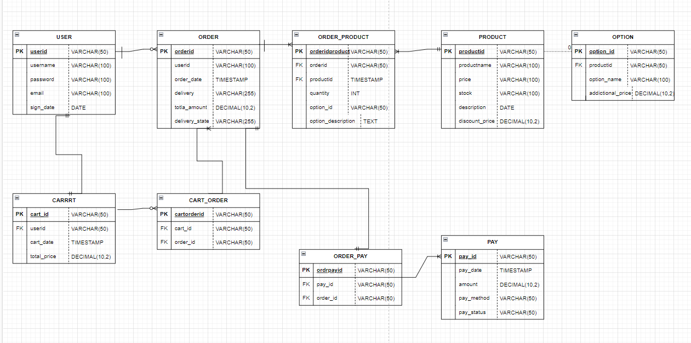

# kodacG-summer-vacation

### 1주차 - ERD, API 설계
| 

[Untitled Database](https://www.notion.so/6432ad6e065242f891f07812475c84a6?pvs=21)

### 2주차 - 상품 관련 DTO 및 ENTITY 구현
| https://scratch-library-74f.notion.site/1-aeba30e7970145119f5231c27c8b2d1d?pvs=4 (맨 아래에 DTO, Entity 예시를 작성했습니다.)

### 3주차 - 상품 조회하기
1. 컨트롤러 : 브라우저에서 URL을 가지고 요청하면 그에 대한 응답을 반환함(리턴값 존재함 무조건)
2. 서비스 : 리포지터리 인터페이스가 지원하는 메소드 같은것들이 나오고 이게 따른 로직이 나옴 엔티티를 DTO로 바꾸는 과정도 포함됨
3. 리포지터리 : 데이터 처리하는 기능 JPA Repository를 상속받는 인터페이스임

DTO와 엔티티
- DTO : Data Transfer Object로 엔티티로만 하면 이게 민감한 정보니까 전달과정에서 사라지면 안되기 때문에 나옴
  - 각 DTO에 필요한 정보만 넣어서 등록하고 조회하고 이런 것들을 할 수 있게 설계하면 됨
- Entity : 데이터베이스에 직접 연결된 테이블
  - 민감한 정보를 가지고 있으니까 조심해야함